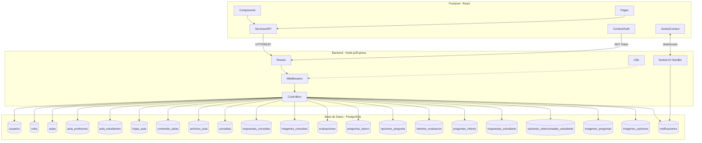
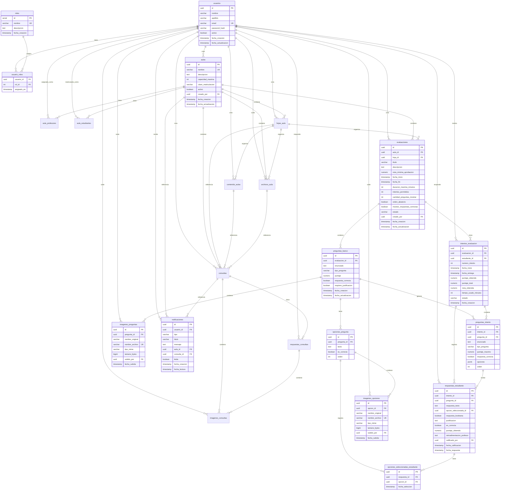
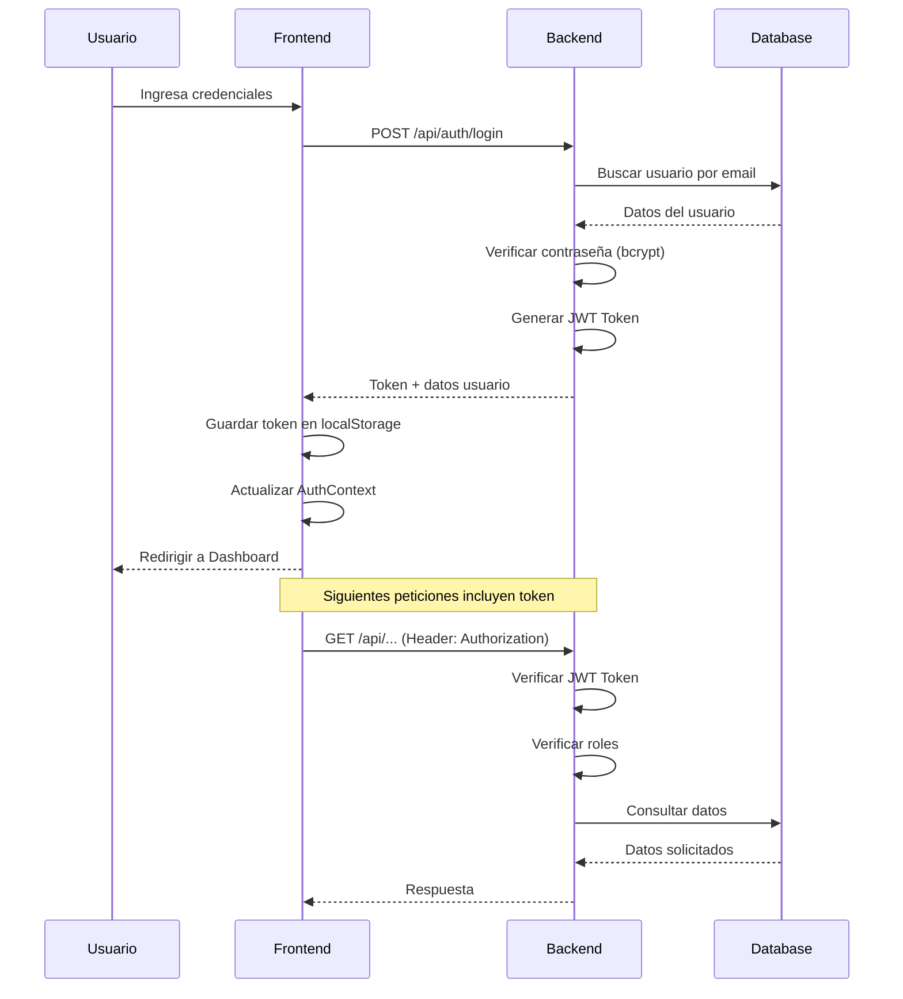
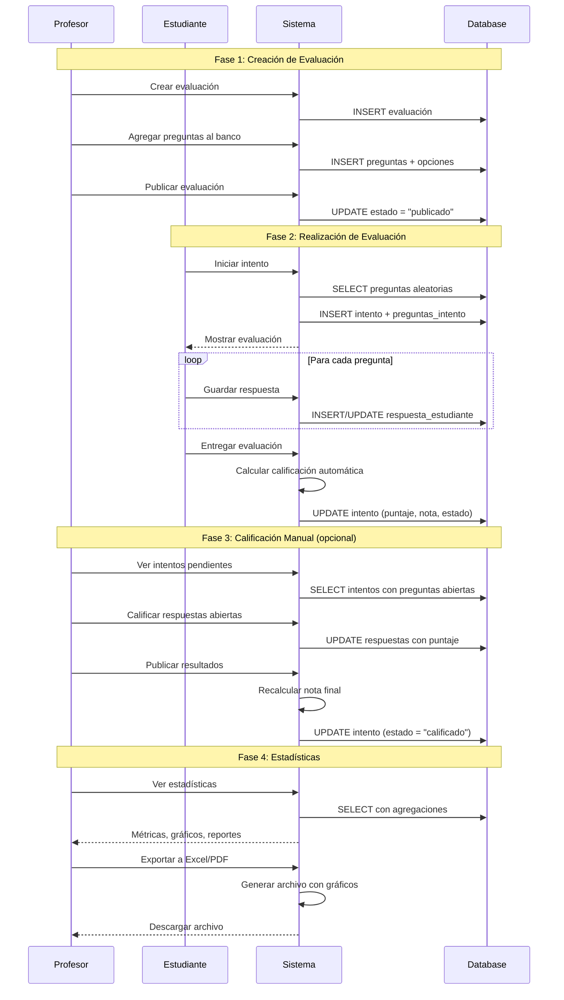
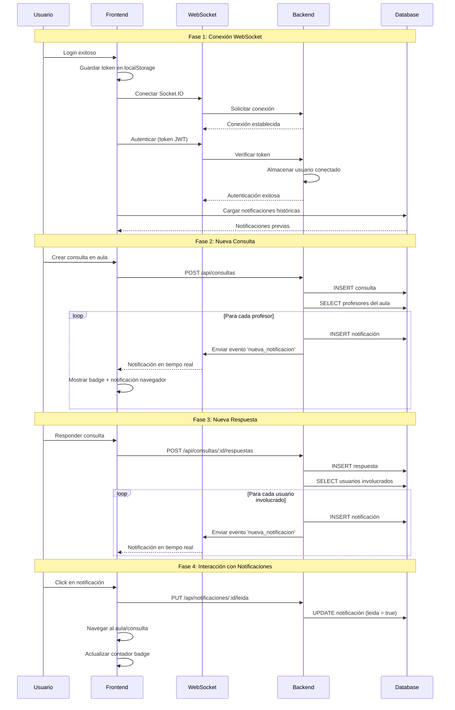

# Aula Virtual

Sistema de gestión de aula virtual con autenticación de usuarios, roles, permisos y evaluaciones.

## Arquitectura del Sistema



## Modelo de Datos



## Flujo de Autenticación



## Flujo de Evaluaciones



## Flujo de Notificaciones en Tiempo Real



## Roles y Permisos

```mermaid
graph TB
    subgraph "Roles del Sistema"
        A[Admin]
        P[Profesor]
        E[Estudiante]
    end

    subgraph "Funcionalidades Admin"
        A1[Crear Aulas]
        A2[Editar Aulas]
        A3[Eliminar Aulas]
        A4[Asignar Profesores]
        A5[Ver Todas las Aulas]
        A6[Gestionar Usuarios]
        A7[Asignar/Quitar Roles]
    end

    subgraph "Funcionalidades Profesor"
        P1[Ver Mis Aulas]
        P2[Gestionar Clave Matriculación]
        P3[Ver Estudiantes]
        P4[Entrar al Aula]
        P5[Gestionar Hojas del Aula]
        P6[Editar Contenido del Aula]
        P7[Agregar/Editar/Eliminar Bloques]
        P8[Reordenar Bloques con Drag&Drop]
        P9[Subir Archivos al Aula]
        P10[Ocultar/Mostrar Archivos]
        P11[Eliminar Archivos]
        P12[Crear Evaluaciones]
        P13[Gestionar Banco de Preguntas]
        P14[Calificar Intentos]
        P15[Ver Estadísticas]
        P16[Exportar a Excel/PDF]
    end

    subgraph "Funcionalidades Estudiante"
        E1[Explorar Aulas]
        E2[Matricularse]
        E3[Ver Mis Aulas]
        E4[Desmatricularse]
        E5[Entrar al Aula]
        E6[Ver Contenido del Aula]
        E7[Realizar Evaluaciones]
        E8[Ver Mis Notas]
        E9[Ver Respuestas Correctas]
    end

    A --> A1 & A2 & A3 & A4 & A5 & A6 & A7
    P --> P1 & P2 & P3 & P4 & P5 & P6 & P7 & P8 & P9 & P10 & P11 & P12 & P13 & P14 & P15 & P16
    E --> E1 & E2 & E3 & E4 & E5 & E6 & E7 & E8 & E9

    MR[Los usuarios pueden tener múltiples roles<br/>y cambiar entre ellos]
    style MR fill:#e1f5ff,stroke:#0066cc,stroke-width:2px
```



## Tecnologías

### Backend
- Node.js + Express
- PostgreSQL
- Socket.IO (WebSocket para notificaciones en tiempo real)
- JWT (autenticación)
- bcrypt (encriptación de contraseñas)
- express-validator (validaciones)
- multer (subida de archivos)
- uuid (generación de IDs únicos)
- exceljs (exportación a Excel)
- pdfkit (generación de PDFs)
- chartjs-node-canvas (gráficos para PDF)

### Frontend
- React 19
- Vite
- React Router DOM v7
- Axios
- Socket.IO Client (WebSocket para notificaciones en tiempo real)
- Tailwind CSS v3
- Lucide React (iconos)
- @dnd-kit (drag and drop)
- PropTypes (validación de tipos)
- Framer Motion (animaciones)
- React Intersection Observer (parallax scrolling)

## Landing Page

La aplicación cuenta con una landing page moderna y atractiva con las siguientes características:

### Diseño y Animaciones
- **Efecto Parallax**: Scroll suave con figuras geométricas decorativas en movimiento
- **Animaciones con Framer Motion**: Transiciones fluidas y efectos visuales profesionales
- **Modo Oscuro Automático**: Detección automática de las preferencias del sistema operativo
- **Diseño Responsivo**: Adaptable a todos los tamaños de pantalla

### Secciones
1. **Hero Section**: Presentación principal con llamados a la acción
2. **Cómo Funciona**: Explicación del sistema para profesores y estudiantes
3. **Beneficios**: Características clave del sistema
4. **Características**: Funcionalidades detalladas
5. **Estadísticas**: Métricas e impacto del proyecto
6. **Contacto**: Links a redes sociales (Email, LinkedIn, GitHub)
7. **Footer**: Navegación y información adicional

### Variables de Entorno
La landing page utiliza variables de entorno para los datos de contacto. Crear un archivo `.env` en `frontend/`:

```env
# Datos de contacto para la Landing Page
VITE_CONTACT_EMAIL=tu-email@ejemplo.com
VITE_CONTACT_LINKEDIN=https://www.linkedin.com/in/tu-perfil
VITE_CONTACT_GITHUB=https://github.com/tu-usuario
```

**Nota**: El archivo `.env` está en `.gitignore` y no se sube al repositorio. Usa `.env.example` como referencia.

## Estructura del Proyecto

```
AulaVirtual/
├── backend/          # API REST con Node.js
│   ├── src/
│   │   ├── config/           # Configuración de la base de datos
│   │   ├── controllers/      # Controladores de lógica de negocio
│   │   │   ├── archivosController.js
│   │   │   ├── authController.js
│   │   │   ├── aulasController.js
│   │   │   ├── consultasController.js
│   │   │   ├── contenidoController.js
│   │   │   ├── evaluacionesController.js
│   │   │   ├── hojasController.js
│   │   │   ├── intentosController.js
│   │   │   ├── matriculacionController.js
│   │   │   ├── notificacionesController.js
│   │   │   ├── preguntasController.js
│   │   │   └── usuariosController.js
│   │   ├── middlewares/      # Middleware de autenticación y autorización
│   │   │   └── auth.js
│   │   ├── routes/           # Definición de rutas de la API
│   │   │   ├── archivosRoutes.js
│   │   │   ├── authRoutes.js
│   │   │   ├── aulasRoutes.js
│   │   │   ├── consultasRoutes.js
│   │   │   ├── contenidoRoutes.js
│   │   │   ├── evaluacionesRoutes.js
│   │   │   ├── hojasRoutes.js
│   │   │   ├── intentosRoutes.js
│   │   │   ├── matriculacionRoutes.js
│   │   │   ├── notificacionesRoutes.js
│   │   │   ├── preguntasRoutes.js
│   │   │   └── usuariosRoutes.js
│   │   ├── socket/           # Manejo de WebSocket
│   │   │   └── socketHandler.js
│   │   ├── utils/            # Utilidades (JWT, etc.)
│   │   │   └── jwt.js
│   │   └── index.js          # Punto de entrada del servidor
│   ├── uploads/          # Archivos subidos por usuarios (no versionado)
│   │   ├── archivos/     # Archivos de aulas
│   │   └── consultas/    # Imágenes de consultas y respuestas
│   └── package.json
│
├── frontend/         # Aplicación React
│   ├── src/
│   │   ├── components/       # Componentes reutilizables
│   │   │   ├── admin/        # Componentes específicos de admin
│   │   │   ├── profesor/     # Componentes específicos de profesor
│   │   │   ├── estudiante/   # Componentes específicos de estudiante
│   │   │   ├── landing/      # Componentes de la landing page
│   │   │   │   ├── LandingNavbar.jsx
│   │   │   │   └── ParallaxSection.jsx
│   │   │   ├── contenido/    # Componentes de bloques de contenido
│   │   │   │   ├── BloqueContenido.jsx
│   │   │   │   ├── ModalEditarBloque.jsx
│   │   │   │   ├── TabsHojas.jsx
│   │   │   │   ├── ModalGestionarHojas.jsx
│   │   │   │   └── ListaArchivos.jsx
│   │   │   ├── NotificacionesMenu.jsx  # Menú de notificaciones en tiempo real
│   │   │   ├── evaluaciones/ # Componentes de evaluaciones
│   │   │   │   ├── EvaluacionesAula.jsx
│   │   │   │   ├── ModalCrearEvaluacion.jsx
│   │   │   │   ├── BancoPreguntas.jsx
│   │   │   │   ├── ModalCrearPregunta.jsx
│   │   │   │   ├── RealizarEvaluacion.jsx
│   │   │   │   ├── MisNotasEvaluacion.jsx
│   │   │   │   ├── VerResultados.jsx
│   │   │   │   ├── IntentosCalificar.jsx
│   │   │   │   ├── CalificarIntento.jsx
│   │   │   │   └── EstadisticasEvaluacion.jsx
│   │   │   ├── Layout.jsx
│   │   │   ├── ProtectedRoute.jsx
│   │   │   └── ThemeToggle.jsx (no usado actualmente)
│   │   ├── contexts/         # Context API
│   │   │   ├── AuthContext.jsx
│   │   │   ├── SocketContext.jsx
│   │   │   └── ThemeContext.jsx
│   │   ├── pages/            # Páginas de la aplicación
│   │   │   ├── LandingPage.jsx # Landing page pública
│   │   │   ├── admin/        # Páginas de admin
│   │   │   │   ├── GestionAulas.jsx
│   │   │   │   └── GestionUsuarios.jsx
│   │   │   ├── profesor/     # Páginas de profesor
│   │   │   │   └── MisAulas.jsx
│   │   │   ├── estudiante/   # Páginas de estudiante
│   │   │   │   ├── ExplorarAulas.jsx
│   │   │   │   └── MisAulas.jsx
│   │   │   ├── Login.jsx
│   │   │   ├── Registro.jsx
│   │   │   ├── Dashboard.jsx
│   │   │   └── VistaAula.jsx
│   │   ├── services/         # Servicios de API
│   │   │   ├── api.js
│   │   │   ├── archivosService.js
│   │   │   ├── authService.js
│   │   │   ├── aulasService.js
│   │   │   ├── consultasService.js
│   │   │   ├── contenidoService.js
│   │   │   ├── evaluacionesService.js
│   │   │   ├── hojasService.js
│   │   │   ├── matriculacionService.js
│   │   │   ├── notificacionesService.js
│   │   │   └── usuariosService.js
│   │   └── App.jsx
│   └── package.json
│
└── context/          # Scripts y contexto de base de datos
    ├── init.sql                    # Script de inicialización de BD
    ├── migration_consultas.sql     # Script de migración para consultas
    └── usuarios_prueba.sql         # Script de usuarios de prueba
```

## Requisitos Previos

- Node.js (v18 o superior)
- PostgreSQL (v14 o superior)
- npm o yarn

## Configuración

### 1. Base de Datos

Crea una base de datos PostgreSQL llamada `AulaVirtual` y ejecuta los siguientes scripts:

```bash
# 1. Ejecuta el script de inicialización de base de datos
psql -U tu_usuario -d postgres -f context/init.sql

# 2. Ejecuta el script de usuarios de prueba (opcional)
psql -U tu_usuario -d AulaVirtual -f context/usuarios_prueba.sql
```

El script `init.sql` crea:
- Tablas: usuarios, roles, usuario_roles, aulas, aula_profesores, aula_estudiantes, hojas_aula, contenido_aulas, archivos_aula, consultas, respuestas_consultas, imagenes_consultas, evaluaciones, preguntas_banco, opciones_pregunta, intentos_evaluacion, preguntas_intento, respuestas_estudiante, opciones_seleccionadas_estudiante, imagenes_preguntas, imagenes_opciones, notificaciones
- Roles por defecto: admin, profesor, estudiante
- Índices para optimización
- Triggers para actualización automática de fechas
- Tipos de bloques de contenido: titulo, subtitulo, parrafo, lista, enlace, separador
- Sistema de hojas/pestañas para organizar contenido
- Sistema de archivos con límite de 100 MB por archivo
- Sistema de consultas públicas y privadas con respuestas e imágenes
- Sistema completo de evaluaciones con tipos de preguntas múltiples
- Soporte para múltiples opciones seleccionadas en preguntas de múltiple choice
- Sistema de puntaje proporcional automático
- Soporte de imágenes en preguntas y opciones de respuesta (hasta 10 MB por imagen)
- Sistema de notificaciones en tiempo real con WebSocket

### Usuarios de Prueba

Si ejecutaste `usuarios_prueba.sql`, tendrás las siguientes credenciales:

**Administrador:**
- Email: `admin@aulavirtual.com`
- Contraseña: `admin123`

**Profesores:**
- Email: `profesor1@aulavirtual.com` - Contraseña: `profesor123`
- Email: `profesor2@aulavirtual.com` - Contraseña: `profesor123`

**Estudiantes:**
- Email: `estudiante1@aulavirtual.com` - Contraseña: `estudiante123`
- Email: `estudiante2@aulavirtual.com` - Contraseña: `estudiante123`

### 2. Backend

```bash
cd backend
npm install
```

Crea un archivo `.env` en la carpeta `backend/`:

```env
PORT=5000
NODE_ENV=development

DB_HOST=localhost
DB_PORT=5432
DB_NAME=AulaVirtual
DB_USER=tu_usuario
DB_PASSWORD=tu_contraseña

JWT_SECRET=tu_secreto_jwt_muy_seguro
JWT_EXPIRES_IN=24h
```

Nota: Asegúrate de crear el archivo `.env` basándote en el ejemplo anterior con tus propias credenciales.

### 3. Frontend

```bash
cd frontend
npm install
```

## Ejecución

### Desarrollo

**Backend:**
```bash
cd backend
npm run dev
```
El servidor correrá en `http://localhost:5000`

**Frontend:**
```bash
cd frontend
npm run dev
```
La aplicación correrá en `http://localhost:5173`

### Producción

**Backend:**
```bash
cd backend
npm run build  # Si existe script de build
npm start
```

**Frontend:**
```bash
cd frontend
npm run build
npm run preview
```

## Funcionalidades

### Autenticación
- ✅ Registro de usuarios
- ✅ Login con email y contraseña
- ✅ Tokens JWT
- ✅ Protección de rutas
- ✅ Roles de usuario (estudiante, profesor, administrador)
- ✅ Usuarios con múltiples roles
- ✅ Selector de rol activo para usuarios con múltiples roles
- ✅ Context API para gestión de estado de autenticación

### Gestión de Aulas (Administrador)
- ✅ Crear aulas con nombre, descripción y capacidad
- ✅ Editar aulas existentes
- ✅ Eliminar/desactivar aulas
- ✅ Asignar profesores a aulas
- ✅ Desasignar profesores de aulas
- ✅ Ver lista completa de aulas del sistema

### Gestión de Usuarios (Administrador)
- ✅ Ver todos los usuarios del sistema con sus roles
- ✅ Agregar roles a usuarios
- ✅ Quitar roles de usuarios
- ✅ Protección: usuarios deben mantener al menos un rol
- ✅ Visualización de roles con códigos de color

### Funcionalidades del Profesor
- ✅ Ver aulas asignadas
- ✅ Gestionar clave de matriculación (pública o privada)
- ✅ Ver lista de estudiantes matriculados
- ✅ Ver información detallada de cada aula
- ✅ Entrar al aula y ver su contenido
- ✅ Modo edición para gestionar contenido
- ✅ Crear bloques de contenido (6 tipos diferentes)
- ✅ Editar bloques existentes
- ✅ Eliminar bloques
- ✅ Reordenar bloques con drag and drop
- ✅ Gestionar hojas/pestañas del aula
- ✅ Crear, editar y eliminar hojas
- ✅ Organizar contenido en diferentes hojas
- ✅ Ocultar/mostrar hojas completas para estudiantes
- ✅ Ocultar/mostrar bloques individuales para estudiantes
- ✅ Preparar contenido anticipadamente sin que estudiantes lo vean
- ✅ Subir archivos al aula (PDF, Office, imágenes, videos, etc.)
- ✅ Ocultar/mostrar archivos individuales para estudiantes
- ✅ Eliminar archivos subidos
- ✅ Límite de 100 MB por archivo
- ✅ Crear consultas públicas y privadas
- ✅ Responder consultas de estudiantes
- ✅ Eliminar consultas y respuestas
- ✅ Adjuntar imágenes a consultas y respuestas (hasta 10 MB por imagen)
- ✅ Crear evaluaciones con configuración avanzada
- ✅ Gestionar banco de preguntas (4 tipos)
- ✅ Agregar imágenes a preguntas y opciones de respuesta
- ✅ Configurar múltiples respuestas correctas en múltiple choice
- ✅ Puntaje proporcional automático para respuestas parciales
- ✅ Calificar respuestas abiertas manualmente
- ✅ Ver estadísticas detalladas de evaluaciones
- ✅ Exportar estadísticas a Excel y PDF con gráficos

### Funcionalidades del Estudiante
- ✅ Explorar aulas disponibles
- ✅ Matricularse en aulas públicas
- ✅ Matricularse en aulas privadas (con clave)
- ✅ Ver aulas en las que está matriculado
- ✅ Desmatricularse de aulas
- ✅ Ver información de profesores asignados
- ✅ Entrar al aula y ver su contenido
- ✅ Visualizar todos los bloques de contenido del aula
- ✅ Descargar archivos compartidos por profesores
- ✅ Crear consultas públicas (todos ven) o privadas (solo profesores)
- ✅ Responder consultas públicas
- ✅ Marcar propias consultas como resueltas
- ✅ Eliminar propias consultas y respuestas
- ✅ Adjuntar imágenes a consultas y respuestas (hasta 10 MB por imagen)
- ✅ Realizar evaluaciones con límite de tiempo
- ✅ Seleccionar múltiples opciones en preguntas de múltiple choice
- ✅ Ver imágenes en preguntas y opciones
- ✅ Ver mis notas y resultados con puntaje proporcional
- ✅ Ver respuestas correctas (si el profesor lo permite)
- ✅ Realizar múltiples intentos (según configuración)
- ✅ Recibir notificaciones en tiempo real de respuestas en sus consultas

### Notificaciones en Tiempo Real
- ✅ Sistema de notificaciones con WebSocket (Socket.IO)
- ✅ Badge con contador de notificaciones no leídas
- ✅ Menú desplegable con historial de notificaciones
- ✅ Notificaciones del navegador (Browser Notifications API)
- ✅ Persistencia en base de datos
- ✅ Navegación directa al contenido desde notificación
- ✅ Marcar como leída individual o todas
- ✅ Eliminar notificaciones
- ✅ Notificaciones inteligentes (solo usuarios involucrados)
- ✅ Reconexión automática de WebSocket

### Seguridad
- Contraseñas encriptadas con bcrypt
- Validación de datos con express-validator
- Protección contra inyección SQL (queries parametrizadas)
- CORS configurado
- Middleware de autenticación JWT
- Control de permisos por rol
- Validación de autoría en evaluaciones

## Sistema de Evaluaciones

### Tipos de Preguntas

1. **Multiple Choice (Opción Múltiple)**
   - Pregunta con múltiples opciones
   - **Soporte para múltiples respuestas correctas**
   - Estudiantes pueden seleccionar múltiples opciones con checkboxes
   - **Puntaje proporcional automático**: (opciones correctas seleccionadas / total opciones correctas) × puntaje
   - Ejemplo: Si hay 3 opciones correctas y el estudiante marca 2 correctas, obtiene 66.67% del puntaje
   - Solo cuenta las selecciones correctas (opciones incorrectas no penalizan)
   - Calificación automática
   - Soporte de imágenes en el enunciado y en cada opción

2. **Verdadero/Falso**
   - Pregunta con dos opciones
   - Calificación automática
   - Respuesta simple y directa
   - Soporte de imágenes en el enunciado

3. **Verdadero/Falso con Justificación**
   - Pregunta V/F con campo de texto adicional
   - Requiere justificación del estudiante
   - Calificación manual de la justificación
   - Soporte de imágenes en el enunciado

4. **Desarrollo (Respuesta Abierta)**
   - Campo de texto extenso
   - Respuesta libre del estudiante
   - Requiere calificación manual del profesor
   - Soporte de imágenes en el enunciado

### Sistema de Puntaje Proporcional

Para preguntas de **múltiple choice con múltiples respuestas correctas**, el sistema implementa un algoritmo de puntaje proporcional justo:

**Fórmula:**
```
Puntaje Obtenido = (Opciones Correctas Seleccionadas / Total Opciones Correctas) × Puntaje de la Pregunta
```

**Características:**
- Solo cuenta las selecciones correctas (positivas)
- Las opciones incorrectas seleccionadas no penalizan
- Si el estudiante no marca ninguna correcta, obtiene 0 puntos
- Si marca todas las correctas y ninguna incorrecta, obtiene 100% del puntaje

**Ejemplos:**

| Opciones Correctas | Seleccionadas Correctas | Seleccionadas Incorrectas | Puntaje (si vale 10 pts) |
|-------------------|------------------------|---------------------------|--------------------------|
| 3                 | 3                      | 0                         | 10.00 pts (100%)         |
| 3                 | 2                      | 0                         | 6.67 pts (66.67%)        |
| 3                 | 2                      | 1                         | 6.67 pts (66.67%)        |
| 3                 | 1                      | 0                         | 3.33 pts (33.33%)        |
| 3                 | 0                      | 3                         | 0.00 pts (0%)            |
| 2                 | 1                      | 0                         | 5.00 pts (50%)           |

**Visualización en Calificación:**
- Los profesores ven todas las opciones seleccionadas
- Código de colores: verde (correctas), rojo (incorrectas)
- Muestra las opciones correctas que no fueron seleccionadas
- Indica el puntaje proporcional calculado

### Gestión de Imágenes en Evaluaciones

**En Preguntas:**
- Los profesores pueden subir múltiples imágenes al enunciado
- Límite: 10 MB por imagen
- Formatos soportados: JPEG, PNG, GIF, WebP
- Las imágenes se muestran en una cuadrícula de 2 columnas
- Los estudiantes pueden hacer clic para ver en tamaño completo

**En Opciones de Respuesta:**
- Cada opción de múltiple choice puede tener sus propias imágenes
- Mismo límite y formatos que en preguntas
- Las imágenes se muestran en una cuadrícula de 3 columnas
- Útil para preguntas visuales (identificar imágenes, diagramas, etc.)

### Configuración de Evaluaciones

Los profesores pueden configurar:
- **Título y descripción** de la evaluación
- **Hoja del aula** donde se organiza
- **Nota mínima de aprobación** (0-10)
- **Fechas de inicio y fin** (disponibilidad)
- **Duración máxima** en minutos
- **Intentos permitidos** por estudiante
- **Cantidad de preguntas a mostrar** (selección aleatoria del banco)
- **Orden aleatorio** de preguntas
- **Mostrar respuestas correctas** después de entregar

### Flujo para Profesores

1. **Crear Evaluación**
   - Configurar parámetros básicos
   - Estado inicial: "borrador"

2. **Gestionar Banco de Preguntas**
   - Agregar preguntas de diferentes tipos
   - Editar preguntas existentes
   - Eliminar preguntas
   - Ver puntaje total del banco

3. **Publicar Evaluación**
   - Cambiar estado a "publicado"
   - Los estudiantes pueden ver y realizar

4. **Calificar Intentos** (si hay preguntas abiertas)
   - Ver intentos pendientes de calificación
   - Calificar respuestas de desarrollo
   - Agregar retroalimentación
   - Publicar resultados

5. **Ver Estadísticas**
   - Métricas generales (promedio, aprobados, etc.)
   - Distribución de notas
   - Rendimiento por pregunta
   - Lista de estudiantes con mejores notas

6. **Exportar Datos**
   - **Excel**: 4 hojas con datos completos
   - **PDF**: Documento profesional con gráficos

### Flujo para Estudiantes

1. **Ver Evaluaciones Disponibles**
   - Solo evaluaciones publicadas
   - Dentro del rango de fechas

2. **Iniciar Intento**
   - Se genera un conjunto de preguntas aleatorias
   - Comienza el conteo de tiempo

3. **Responder Preguntas**
   - Respuestas se guardan automáticamente
   - Indicadores visuales de progreso

4. **Entregar Evaluación**
   - Calificación automática inmediata para MC y V/F
   - Estado "pendiente" si hay preguntas abiertas

5. **Ver Resultados**
   - Nota obtenida y puntaje
   - Respuestas correctas (si el profesor lo permite)
   - Retroalimentación del profesor
   - Historial de intentos

### Estadísticas y Reportes

**Métricas Generales:**
- Total de estudiantes que realizaron
- Total de intentos
- Nota promedio, mínima y máxima
- Tasa de aprobación
- Tiempo promedio de realización

**Distribución de Notas:**
- Gráfico de barras con rangos (0-2, 2-4, 4-6, 6-8, 8-10)
- Cantidad de estudiantes por rango

**Rendimiento por Pregunta:**
- Total de respuestas
- Porcentaje de acierto
- Puntaje promedio
- Identificación de preguntas difíciles

**Lista de Estudiantes:**
- Mejor intento de cada estudiante
- Puntaje obtenido vs total
- Nota final
- Tiempo utilizado
- Estado (aprobado/desaprobado)

### Exportación de Estadísticas

**Excel (4 hojas):**
1. Métricas Generales: Resumen con indicadores clave
2. Estudiantes: Lista completa con detalles
3. Rendimiento por Pregunta: Análisis detallado
4. Distribución de Notas: Datos para gráficos

**PDF (con gráficos):**
- Portada con título y fecha
- Métricas generales destacadas
- Gráfico de barras de distribución de notas
- Tabla de top 20 estudiantes
- Gráfico horizontal de rendimiento por pregunta (top 10)
- Formato profesional listo para imprimir

### Casos de Uso

**Evaluación Rápida:**
```
1. Profesor crea evaluación con 10 preguntas MC
2. Configura 30 minutos de duración
3. Permite 1 solo intento
4. Publica la evaluación
5. Estudiantes realizan y obtienen nota automática
```

**Evaluación con Calificación Manual:**
```
1. Profesor crea evaluación mixta (MC + Desarrollo)
2. Estudiantes completan
3. Preguntas MC se califican automáticamente
4. Profesor califica preguntas de desarrollo
5. Profesor publica resultados finales
```

**Examen con Múltiples Intentos:**
```
1. Profesor permite 3 intentos
2. Estudiante realiza primer intento: 6.5
3. Estudia y realiza segundo intento: 7.8
4. Sistema guarda el mejor intento
5. Estudiante ve su progreso
```

## API Endpoints

### Evaluaciones

**POST** `/api/evaluaciones`
- Crear una nueva evaluación
- Acceso: Profesores asignados al aula
- Body: `{ aula_id, hoja_id?, titulo, descripcion?, nota_minima_aprobacion, fecha_inicio?, fecha_fin?, duracion_maxima_minutos?, intentos_permitidos, cantidad_preguntas_mostrar, orden_aleatorio, mostrar_respuestas_correctas }`

**GET** `/api/evaluaciones/aula/:aula_id`
- Obtener todas las evaluaciones de un aula
- Acceso: Profesores, estudiantes y admin con acceso al aula
- Filtrado automático: estudiantes solo ven publicadas

**GET** `/api/evaluaciones/:evaluacion_id`
- Obtener detalle de una evaluación específica
- Acceso: Profesores, estudiantes y admin con acceso al aula

**PUT** `/api/evaluaciones/:evaluacion_id`
- Actualizar una evaluación
- Acceso: Profesores asignados al aula
- Body: Campos a actualizar

**DELETE** `/api/evaluaciones/:evaluacion_id`
- Eliminar una evaluación
- Acceso: Profesores asignados al aula y admin

**GET** `/api/evaluaciones/:evaluacion_id/estadisticas`
- Obtener estadísticas de una evaluación
- Acceso: Profesores asignados al aula y admin
- Respuesta: Métricas, distribución de notas, rendimiento por pregunta, estudiantes

**GET** `/api/evaluaciones/:evaluacion_id/exportar-excel`
- Exportar estadísticas a Excel
- Acceso: Profesores asignados al aula y admin
- Respuesta: Archivo Excel con 4 hojas

**GET** `/api/evaluaciones/:evaluacion_id/exportar-pdf`
- Exportar estadísticas a PDF con gráficos
- Acceso: Profesores asignados al aula y admin
- Respuesta: Archivo PDF profesional

### Preguntas

**POST** `/api/preguntas`
- Crear una nueva pregunta en el banco
- Acceso: Profesores asignados al aula
- Body: `{ evaluacion_id, enunciado, tipo_pregunta, puntaje, respuesta_correcta?, opciones?, requiere_justificacion? }`
- Tipos: `multiple_choice`, `verdadero_falso`, `verdadero_falso_justificacion`, `desarrollo`

**GET** `/api/preguntas/evaluacion/:evaluacion_id`
- Obtener todas las preguntas de una evaluación
- Acceso: Profesores asignados al aula

**GET** `/api/preguntas/:pregunta_id`
- Obtener detalle de una pregunta
- Acceso: Profesores asignados al aula

**PUT** `/api/preguntas/:pregunta_id`
- Actualizar una pregunta
- Acceso: Profesores asignados al aula
- Body: Campos a actualizar

**DELETE** `/api/preguntas/:pregunta_id`
- Eliminar una pregunta
- Acceso: Profesores asignados al aula

### Intentos

**POST** `/api/intentos/iniciar`
- Iniciar un nuevo intento de evaluación
- Acceso: Estudiantes matriculados en el aula
- Body: `{ evaluacion_id }`
- Genera preguntas aleatorias del banco

**GET** `/api/intentos/:intento_id`
- Obtener detalles de un intento
- Acceso: Estudiante autor del intento o profesores

**POST** `/api/intentos/:intento_id/respuesta`
- Guardar respuesta de una pregunta
- Acceso: Estudiante autor del intento
- Body: `{ pregunta_id, respuesta_texto?, opcion_seleccionada_id?, opciones_seleccionadas?, respuesta_booleana?, justificacion? }`
- Para múltiple choice: usar `opciones_seleccionadas` como array de IDs para múltiples selecciones

**POST** `/api/intentos/:intento_id/entregar`
- Entregar el intento
- Acceso: Estudiante autor del intento
- Califica automáticamente y actualiza estado

**GET** `/api/intentos/evaluacion/:evaluacion_id/mis-intentos`
- Obtener mis intentos en una evaluación
- Acceso: Estudiantes matriculados

**GET** `/api/intentos/evaluacion/:evaluacion_id/pendientes`
- Obtener intentos pendientes de calificación
- Acceso: Profesores asignados al aula y admin

**GET** `/api/intentos/:intento_id/calificar`
- Obtener intento con todas las respuestas para calificar
- Acceso: Profesores asignados al aula y admin

**PUT** `/api/intentos/:intento_id/respuesta/:respuesta_id/calificar`
- Calificar una respuesta individual
- Acceso: Profesores asignados al aula y admin
- Body: `{ puntaje_obtenido, retroalimentacion? }`

**POST** `/api/intentos/:intento_id/publicar`
- Publicar resultados del intento (recalcular nota y cambiar estado)
- Acceso: Profesores asignados al aula y admin

### Imágenes en Evaluaciones

**POST** `/api/preguntas/:pregunta_id/imagen`
- Subir imagen a una pregunta
- Acceso: Profesores asignados al aula
- Content-Type: multipart/form-data
- Body: FormData con campo 'imagen'
- Límite: 10 MB por imagen
- Formatos: JPEG, PNG, GIF, WebP

**GET** `/api/preguntas/:pregunta_id/imagenes`
- Obtener todas las imágenes de una pregunta
- Acceso: Profesores asignados al aula
- Respuesta: Array de objetos imagen con ID, nombre_archivo, etc.

**DELETE** `/api/preguntas/imagenes/:imagen_id`
- Eliminar imagen de una pregunta
- Acceso: Profesores asignados al aula

**POST** `/api/preguntas/opciones/:opcion_id/imagen`
- Subir imagen a una opción de respuesta
- Acceso: Profesores asignados al aula
- Content-Type: multipart/form-data
- Body: FormData con campo 'imagen'
- Límite: 10 MB por imagen

**GET** `/api/preguntas/opciones/:opcion_id/imagenes`
- Obtener todas las imágenes de una opción
- Acceso: Profesores asignados al aula

**DELETE** `/api/preguntas/opciones/imagenes/:imagen_id`
- Eliminar imagen de una opción
- Acceso: Profesores asignados al aula

**Visualización de imágenes:**
- URL base: `http://localhost:5001/uploads/evaluaciones/`
- Las imágenes son servidas como archivos estáticos
- Los estudiantes pueden ver las imágenes durante la evaluación
- Clic en la imagen abre en nueva pestaña para ver en tamaño completo

## Mejoras Recientes

### Sistema de Consultas Mejorado
- ✅ **Eliminación automática de archivos físicos**: Los archivos de imágenes se eliminan del servidor cuando se borran consultas, respuestas o evaluaciones
- ✅ **Búsqueda y filtrado avanzado**:
  - Campo de búsqueda por título, contenido y autor
  - Ordenamiento por fecha (recientes/antiguas) y cantidad de respuestas
  - Botón de limpieza rápida de búsqueda
- ✅ **Sistema de paginación completo**:
  - Navegación con botones Anterior/Siguiente
  - Selector de items por página (5, 10, 20, 50)
  - Números de página clickeables
  - Navegación inteligente con puntos suspensivos
  - Auto-reset al cambiar filtros
  - Información de resultados (mostrando X-Y de Z)

### Correcciones de UI
- ✅ **Visibilidad mejorada en modales**: Botones de cierre (X) y campos de texto ahora son claramente visibles con colores adecuados

## Sistema de Notificaciones en Tiempo Real

### Arquitectura Implementada

**Tecnologías:**
- Backend: Socket.IO (WebSocket sobre HTTP)
- Frontend: socket.io-client + React Context (SocketContext)
- Base de datos: Tabla `notificaciones` con persistencia completa
- Autenticación: JWT para autenticar conexiones WebSocket

### Características Implementadas

**Conexión y Autenticación:**
- Conexión WebSocket automática al iniciar sesión
- Autenticación mediante token JWT
- Reconexión automática con reintentos exponenciales
- Gestión de usuarios conectados en servidor

**Notificaciones en Tiempo Real:**
- Badge con contador de notificaciones no leídas en el navbar
- Menú desplegable con historial de notificaciones
- Notificaciones del navegador (Browser Notifications API)
- Persistencia completa en base de datos
- Navegación directa al aula/consulta desde la notificación

**Gestión de Notificaciones:**
- Marcar individual como leída
- Marcar todas como leídas
- Eliminar notificaciones
- Filtrado por estado (leídas/no leídas)
- Ordenamiento por fecha
- Formato de tiempo relativo (hace 5 min, hace 2h, etc.)

### Reglas de Notificación

**Estudiantes reciben notificaciones cuando:**
1. Alguien responde a una consulta que el estudiante creó
2. Alguien responde a una consulta donde el estudiante ha participado (escribió al menos una respuesta)
3. NO reciben notificaciones de consultas públicas donde no están involucrados

**Profesores reciben notificaciones cuando:**
1. Se crea una nueva consulta en el aula (pública o privada)
2. Una consulta es marcada como resuelta por un estudiante

**Tipos de Notificaciones:**
- `nueva_consulta` - Nueva consulta creada en el aula (color azul)
- `nueva_respuesta` - Respuesta en consulta donde el usuario participa (color verde)
- `consulta_resuelta` - Consulta marcada como resuelta (color morado)

### Eventos WebSocket

**Cliente → Servidor:**
- `authenticate` - Autenticar usuario con token JWT
- `marcar_leida` - Marcar notificación como leída

**Servidor → Cliente:**
- `authenticated` - Confirmación de autenticación exitosa
- `authentication_error` - Error en la autenticación
- `nueva_notificacion` - Nueva notificación para el usuario
- `notificacion_marcada` - Confirmación de notificación marcada

### API Endpoints de Notificaciones

**GET** `/api/notificaciones`
- Obtener notificaciones del usuario autenticado
- Acceso: Todos los usuarios autenticados
- Query params: `limit`, `offset`, `solo_no_leidas`
- Respuesta: Lista de notificaciones + contador de no leídas

**PUT** `/api/notificaciones/:notificacion_id/leida`
- Marcar una notificación como leída
- Acceso: Usuario propietario de la notificación
- Actualiza `leida = true` y `fecha_lectura`

**PUT** `/api/notificaciones/marcar-todas-leidas`
- Marcar todas las notificaciones del usuario como leídas
- Acceso: Todos los usuarios autenticados

**DELETE** `/api/notificaciones/:notificacion_id`
- Eliminar una notificación
- Acceso: Usuario propietario de la notificación

### Integración con Sistema de Consultas

El sistema de notificaciones está integrado con el módulo de consultas:

**En `consultasController.js`:**
```javascript
// Al crear una consulta
await crearNotificacion({
  usuario_id: profesor_id,
  tipo: 'nueva_consulta',
  titulo: 'Nueva consulta',
  mensaje: `Nueva consulta en ${nombreAula}: ${titulo}`,
  aula_id: aula_id,
  consulta_id: consulta_id
});

// Al crear una respuesta
await crearNotificacion({
  usuario_id: usuario_involucrado_id,
  tipo: 'nueva_respuesta',
  titulo: 'Nueva respuesta en consulta',
  mensaje: `${nombreResponde} respondió en "${consultaTitulo}"`,
  aula_id: aula_id,
  consulta_id: consulta_id
});

// Al marcar como resuelta
await crearNotificacion({
  usuario_id: profesor_id,
  tipo: 'consulta_resuelta',
  titulo: 'Consulta resuelta',
  mensaje: `Consulta resuelta en ${nombreAula}: "${consultaTitulo}"`,
  aula_id: aula_id,
  consulta_id: consulta_id
});
```

### Componentes Frontend

**SocketContext (`frontend/src/contexts/SocketContext.jsx`):**
- Provider global para gestión de WebSocket
- Hook `useSocket()` para acceder a notificaciones y funciones
- Manejo de estados: `connected`, `notificaciones`, `notificacionesNoLeidas`
- Funciones: `cargarNotificaciones()`, `marcarComoLeida()`, `marcarTodasComoLeidas()`, `eliminarNotificacion()`

**NotificacionesMenu (`frontend/src/components/NotificacionesMenu.jsx`):**
- Botón con icono de campana y badge con contador
- Menú desplegable con lista de notificaciones
- Botón "Marcar todas como leídas"
- Indicadores visuales (color de fondo para no leídas)
- Navegación al hacer clic en notificación
- Formato de fecha relativo

**Integración en Layout:**
```jsx
import { SocketProvider } from './contexts/SocketContext';
import NotificacionesMenu from './components/NotificacionesMenu';

<SocketProvider>
  <App>
    <Layout>
      <NotificacionesMenu />
    </Layout>
  </App>
</SocketProvider>
```

### Ventajas del Sistema

**Para Usuarios:**
- Reciben notificaciones instantáneas sin recargar la página
- No pierden información cuando no están conectados (persistencia)
- Pueden navegar directamente al contenido relevante
- Notificaciones del navegador incluso con la pestaña en segundo plano

**Para el Sistema:**
- Escalable: Solo notifica a usuarios involucrados
- Eficiente: WebSocket mantiene una sola conexión bidireccional
- Robusto: Reconexión automática en caso de desconexión
- Seguro: Autenticación JWT para conexiones WebSocket

## Autor

Desarrollado por Angel Nicolas Magro

## Licencia

Este proyecto es privado y está bajo desarrollo.
