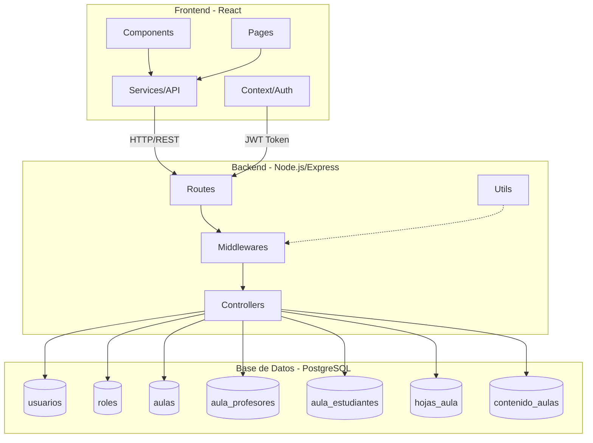

# Aula Virtual

Sistema de gestión de aula virtual con autenticación de usuarios, roles y permisos.

## Arquitectura del Sistema



## Modelo de Datos

```mermaid
erDiagram
    usuarios ||--o{ usuario_roles : tiene
    roles ||--o{ usuario_roles : asigna
    usuarios ||--o{ aulas : crea
    usuarios ||--o{ aula_profesores : asignado_como
    usuarios ||--o{ aula_estudiantes : matriculado_como
    usuarios ||--o{ hojas_aula : crea
    usuarios ||--o{ contenido_aulas : crea
    aulas ||--o{ aula_profesores : tiene
    aulas ||--o{ aula_estudiantes : tiene
    aulas ||--o{ hojas_aula : contiene
    hojas_aula ||--o{ contenido_aulas : organiza

    usuarios {
        uuid id PK
        varchar nombre
        varchar apellido
        varchar email UK
        varchar password_hash
        boolean activo
        timestamp fecha_creacion
        timestamp fecha_actualizacion
    }

    roles {
        serial id PK
        varchar nombre UK
        text descripcion
        timestamp fecha_creacion
    }

    usuario_roles {
        uuid usuario_id FK
        int rol_id FK
        timestamp asignado_en
    }

    aulas {
        uuid id PK
        varchar nombre UK
        text descripcion
        int capacidad_maxima
        varchar clave_matriculacion
        boolean activo
        uuid creado_por FK
        timestamp fecha_creacion
        timestamp fecha_actualizacion
    }

    aula_profesores {
        uuid aula_id FK
        uuid profesor_id FK
        uuid asignado_por FK
        timestamp asignado_en
        boolean activo
    }

    aula_estudiantes {
        uuid aula_id FK
        uuid estudiante_id FK
        timestamp fecha_matriculacion
        boolean activo
    }

    hojas_aula {
        uuid id PK
        uuid aula_id FK
        varchar nombre
        int orden
        boolean visible
        boolean activo
        uuid creado_por FK
        timestamp fecha_creacion
        timestamp fecha_actualizacion
    }

    contenido_aulas {
        uuid id PK
        uuid aula_id FK
        uuid hoja_id FK
        varchar tipo
        text contenido
        int orden
        boolean visible
        uuid creado_por FK
        timestamp fecha_creacion
        timestamp fecha_actualizacion
    }
```



## Flujo de Autenticación


## Roles y Permisos

```mermaid
graph TB
    subgraph "Roles del Sistema"
        A[Admin]
        P[Profesor]
        E[Estudiante]
    end

    subgraph "Funcionalidades Admin"
        A1[Crear Aulas]
        A2[Editar Aulas]
        A3[Eliminar Aulas]
        A4[Asignar Profesores]
        A5[Ver Todas las Aulas]
        A6[Gestionar Usuarios]
        A7[Asignar/Quitar Roles]
    end

    subgraph "Funcionalidades Profesor"
        P1[Ver Mis Aulas]
        P2[Gestionar Clave Matriculación]
        P3[Ver Estudiantes]
        P4[Entrar al Aula]
        P5[Gestionar Hojas del Aula]
        P6[Editar Contenido del Aula]
        P7[Agregar/Editar/Eliminar Bloques]
        P8[Reordenar Bloques con Drag&Drop]
    end

    subgraph "Funcionalidades Estudiante"
        E1[Explorar Aulas]
        E2[Matricularse]
        E3[Ver Mis Aulas]
        E4[Desmatricularse]
        E5[Entrar al Aula]
        E6[Ver Contenido del Aula]
    end

    A --> A1 & A2 & A3 & A4 & A5 & A6 & A7
    P --> P1 & P2 & P3 & P4 & P5 & P6 & P7 & P8
    E --> E1 & E2 & E3 & E4 & E5 & E6

    MR[Los usuarios pueden tener múltiples roles<br/>y cambiar entre ellos]
    style MR fill:#e1f5ff,stroke:#0066cc,stroke-width:2px
```



## Tecnologías

### Backend
- Node.js + Express
- PostgreSQL
- JWT (autenticación)
- bcrypt (encriptación de contraseñas)
- express-validator (validaciones)

### Frontend
- React 19
- Vite
- React Router DOM v7
- Axios
- Tailwind CSS v3
- Lucide React (iconos)
- @dnd-kit (drag and drop)
- PropTypes (validación de tipos)

## Estructura del Proyecto

```
AulaVirtual/
├── backend/          # API REST con Node.js
│   ├── src/
│   │   ├── config/           # Configuración de la base de datos
│   │   ├── controllers/      # Controladores de lógica de negocio
│   │   │   ├── authController.js
│   │   │   ├── aulasController.js
│   │   │   ├── contenidoController.js
│   │   │   ├── hojasController.js
│   │   │   ├── matriculacionController.js
│   │   │   └── usuariosController.js
│   │   ├── middlewares/      # Middleware de autenticación y autorización
│   │   │   └── auth.js
│   │   ├── routes/           # Definición de rutas de la API
│   │   │   ├── authRoutes.js
│   │   │   ├── aulasRoutes.js
│   │   │   ├── contenidoRoutes.js
│   │   │   ├── hojasRoutes.js
│   │   │   ├── matriculacionRoutes.js
│   │   │   └── usuariosRoutes.js
│   │   ├── utils/            # Utilidades (JWT, etc.)
│   │   │   └── jwt.js
│   │   └── index.js          # Punto de entrada del servidor
│   └── package.json
│
├── frontend/         # Aplicación React
│   ├── src/
│   │   ├── components/       # Componentes reutilizables
│   │   │   ├── admin/        # Componentes específicos de admin
│   │   │   ├── profesor/     # Componentes específicos de profesor
│   │   │   ├── estudiante/   # Componentes específicos de estudiante
│   │   │   ├── contenido/    # Componentes de bloques de contenido
│   │   │   │   ├── BloqueContenido.jsx
│   │   │   │   ├── ModalEditarBloque.jsx
│   │   │   │   ├── TabsHojas.jsx
│   │   │   │   └── ModalGestionarHojas.jsx
│   │   │   ├── Layout.jsx
│   │   │   └── ProtectedRoute.jsx
│   │   ├── contexts/         # Context API (autenticación)
│   │   │   └── AuthContext.jsx
│   │   ├── pages/            # Páginas de la aplicación
│   │   │   ├── admin/        # Páginas de admin
│   │   │   │   ├── GestionAulas.jsx
│   │   │   │   └── GestionUsuarios.jsx
│   │   │   ├── profesor/     # Páginas de profesor
│   │   │   │   └── MisAulas.jsx
│   │   │   ├── estudiante/   # Páginas de estudiante
│   │   │   │   ├── ExplorarAulas.jsx
│   │   │   │   └── MisAulas.jsx
│   │   │   ├── Login.jsx
│   │   │   ├── Registro.jsx
│   │   │   ├── Dashboard.jsx
│   │   │   └── VistaAula.jsx
│   │   ├── services/         # Servicios de API
│   │   │   ├── api.js
│   │   │   ├── authService.js
│   │   │   ├── aulasService.js
│   │   │   ├── contenidoService.js
│   │   │   ├── hojasService.js
│   │   │   ├── matriculacionService.js
│   │   │   └── usuariosService.js
│   │   └── App.jsx
│   └── package.json
│
└── context/          # Scripts y contexto de base de datos
    ├── init.sql              # Script de inicialización de BD
    └── usuarios_prueba.sql   # Script de usuarios de prueba
```

## Requisitos Previos

- Node.js (v18 o superior)
- PostgreSQL (v14 o superior)
- npm o yarn

## Configuración

### 1. Base de Datos

Crea una base de datos PostgreSQL llamada `AulaVirtual` y ejecuta los siguientes scripts:

```bash
# 1. Ejecuta el script de inicialización de base de datos
psql -U tu_usuario -d postgres -f context/init.sql

# 2. Ejecuta el script de usuarios de prueba (opcional)
psql -U tu_usuario -d AulaVirtual -f context/usuarios_prueba.sql
```

El script `init.sql` crea:
- Tablas: usuarios, roles, usuario_roles, aulas, aula_profesores, aula_estudiantes, hojas_aula, contenido_aulas
- Roles por defecto: admin, profesor, estudiante
- Índices para optimización
- Triggers para actualización automática de fechas
- Tipos de bloques de contenido: titulo, subtitulo, parrafo, lista, enlace, separador
- Sistema de hojas/pestañas para organizar contenido

### Usuarios de Prueba

Si ejecutaste `usuarios_prueba.sql`, tendrás las siguientes credenciales:

**Administrador:**
- Email: `admin@aulavirtual.com`
- Contraseña: `admin123`

**Profesores:**
- Email: `profesor1@aulavirtual.com` - Contraseña: `profesor123`
- Email: `profesor2@aulavirtual.com` - Contraseña: `profesor123`

**Estudiantes:**
- Email: `estudiante1@aulavirtual.com` - Contraseña: `estudiante123`
- Email: `estudiante2@aulavirtual.com` - Contraseña: `estudiante123`

### 2. Backend

```bash
cd backend
npm install
```

Crea un archivo `.env` en la carpeta `backend/`:

```env
PORT=5000
NODE_ENV=development

DB_HOST=localhost
DB_PORT=5432
DB_NAME=AulaVirtual
DB_USER=tu_usuario
DB_PASSWORD=tu_contraseña

JWT_SECRET=tu_secreto_jwt_muy_seguro
JWT_EXPIRES_IN=24h
```

Nota: Asegúrate de crear el archivo `.env` basándote en el ejemplo anterior con tus propias credenciales.

### 3. Frontend

```bash
cd frontend
npm install
```

## Ejecución

### Desarrollo

**Backend:**
```bash
cd backend
npm run dev
```
El servidor correrá en `http://localhost:5000`

**Frontend:**
```bash
cd frontend
npm run dev
```
La aplicación correrá en `http://localhost:5173`

### Producción

**Backend:**
```bash
cd backend
npm run build  # Si existe script de build
npm start
```

**Frontend:**
```bash
cd frontend
npm run build
npm run preview
```

## Funcionalidades

### Autenticación
- ✅ Registro de usuarios
- ✅ Login con email y contraseña
- ✅ Tokens JWT
- ✅ Protección de rutas
- ✅ Roles de usuario (estudiante, profesor, administrador)
- ✅ Usuarios con múltiples roles
- ✅ Selector de rol activo para usuarios con múltiples roles
- ✅ Context API para gestión de estado de autenticación

### Gestión de Aulas (Administrador)
- ✅ Crear aulas con nombre, descripción y capacidad
- ✅ Editar aulas existentes
- ✅ Eliminar/desactivar aulas
- ✅ Asignar profesores a aulas
- ✅ Desasignar profesores de aulas
- ✅ Ver lista completa de aulas del sistema

### Gestión de Usuarios (Administrador)
- ✅ Ver todos los usuarios del sistema con sus roles
- ✅ Agregar roles a usuarios
- ✅ Quitar roles de usuarios
- ✅ Protección: usuarios deben mantener al menos un rol
- ✅ Visualización de roles con códigos de color

### Funcionalidades del Profesor
- ✅ Ver aulas asignadas
- ✅ Gestionar clave de matriculación (pública o privada)
- ✅ Ver lista de estudiantes matriculados
- ✅ Ver información detallada de cada aula
- ✅ Entrar al aula y ver su contenido
- ✅ Modo edición para gestionar contenido
- ✅ Crear bloques de contenido (6 tipos diferentes)
- ✅ Editar bloques existentes
- ✅ Eliminar bloques
- ✅ Reordenar bloques con drag and drop
- ✅ Gestionar hojas/pestañas del aula
- ✅ Crear, editar y eliminar hojas
- ✅ Organizar contenido en diferentes hojas
- ✅ Ocultar/mostrar hojas completas para estudiantes
- ✅ Ocultar/mostrar bloques individuales para estudiantes
- ✅ Preparar contenido anticipadamente sin que estudiantes lo vean

### Funcionalidades del Estudiante
- ✅ Explorar aulas disponibles
- ✅ Matricularse en aulas públicas
- ✅ Matricularse en aulas privadas (con clave)
- ✅ Ver aulas en las que está matriculado
- ✅ Desmatricularse de aulas
- ✅ Ver información de profesores asignados
- ✅ Entrar al aula y ver su contenido
- ✅ Visualizar todos los bloques de contenido del aula

### Seguridad
- Contraseñas encriptadas con bcrypt
- Validación de datos con express-validator
- Protección contra inyección SQL (queries parametrizadas)
- CORS configurado
- Middleware de autenticación JWT

## API Endpoints

### Autenticación

**POST** `/api/auth/registro`
- Registra un nuevo usuario (rol estudiante por defecto)
- Body: `{ nombre, apellido, email, password }`
- Respuesta: `{ success, message, data: { usuario, token } }`

**POST** `/api/auth/login`
- Inicia sesión
- Body: `{ email, password }`
- Respuesta: `{ success, message, data: { usuario, token } }`

### Aulas (Admin)

Requieren header: `Authorization: Bearer <token>` y rol **admin**

**GET** `/api/aulas`
- Lista todas las aulas del sistema
- Respuesta: `{ success, data: [...aulas], total }`

**POST** `/api/aulas`
- Crea una nueva aula
- Body: `{ nombre, descripcion, capacidad_maxima }`
- Respuesta: `{ success, message, data: aula }`

**PUT** `/api/aulas/:id`
- Actualiza una aula existente
- Body: `{ nombre, descripcion, capacidad_maxima, activo }`
- Respuesta: `{ success, message, data: aula }`

**DELETE** `/api/aulas/:id`
- Elimina (desactiva) un aula
- Respuesta: `{ success, message }`

**POST** `/api/aulas/asignar-profesor`
- Asigna un profesor a un aula
- Body: `{ aula_id, profesor_id }`
- Respuesta: `{ success, message }`

**DELETE** `/api/aulas/desasignar-profesor/:aula_id/:profesor_id`
- Desasigna un profesor de un aula
- Respuesta: `{ success, message }`

### Matriculación - Profesores

Requieren header: `Authorization: Bearer <token>` y rol **profesor**

**PUT** `/api/matriculacion/aula/clave`
- Gestiona la clave de matriculación de un aula
- Body: `{ aula_id, clave_matriculacion }` (null = aula pública)
- Respuesta: `{ success, message, data }`

**GET** `/api/matriculacion/aula/:aula_id/estudiantes`
- Obtiene lista de estudiantes de un aula
- Respuesta: `{ success, data: [...estudiantes], total }`

### Matriculación - Estudiantes

Requieren header: `Authorization: Bearer <token>` y rol **estudiante**

**GET** `/api/matriculacion/aulas-disponibles`
- Lista todas las aulas disponibles para matriculación
- Respuesta: `{ success, data: [...aulas], total }`

**POST** `/api/matriculacion/matricularse`
- Matricularse en un aula
- Body: `{ aula_id, clave_matriculacion }` (clave solo si es requerida)
- Respuesta: `{ success, message, data }`

**GET** `/api/matriculacion/mis-aulas`
- Lista aulas donde el estudiante está matriculado
- Respuesta: `{ success, data: [...aulas], total }`

**DELETE** `/api/matriculacion/desmatricularse/:aula_id`
- Desmatricularse de un aula
- Respuesta: `{ success, message }`

### Usuarios (Admin)

Requieren header: `Authorization: Bearer <token>` y rol **admin**

**GET** `/api/usuarios`
- Obtener todos los usuarios del sistema con sus roles
- Respuesta: `{ success, data: [...usuarios], total }`

**GET** `/api/usuarios/roles`
- Obtener todos los roles disponibles del sistema
- Respuesta: `{ success, data: [...roles], total }`

**GET** `/api/usuarios/por-rol`
- Listar usuarios filtrados por rol
- Query params: `rol` (admin/profesor/estudiante), `busqueda` (opcional)
- Respuesta: `{ success, data: [...usuarios], total }`

**POST** `/api/usuarios/agregar-rol`
- Agregar un rol a un usuario
- Body: `{ usuario_id, rol_id }`
- Respuesta: `{ success, message }`

**DELETE** `/api/usuarios/:usuario_id/roles/:rol_id`
- Quitar un rol de un usuario (requiere tener mínimo 2 roles)
- Respuesta: `{ success, message }`

### Contenido de Aulas

Requieren header: `Authorization: Bearer <token>`

**GET** `/api/contenido/aula/:aula_id?hoja_id=<uuid>`
- Obtener todo el contenido de una hoja específica de un aula ordenado
- Requiere query parameter `hoja_id`
- Acceso: Profesores asignados, estudiantes matriculados, admin
- Respuesta: `{ success, data: [...bloques], total }`

**POST** `/api/contenido/bloque`
- Crear un nuevo bloque de contenido
- Acceso: Solo profesores asignados al aula
- Body: `{ aula_id, hoja_id, tipo, contenido, orden }`
- Tipos válidos: `titulo`, `subtitulo`, `parrafo`, `lista`, `enlace`, `separador`
- Respuesta: `{ success, message, data: bloque }`

**PUT** `/api/contenido/bloque/:bloque_id`
- Actualizar un bloque de contenido existente
- Acceso: Solo profesores asignados al aula
- Body: `{ tipo, contenido, orden }`
- Respuesta: `{ success, message, data: bloque }`

**DELETE** `/api/contenido/bloque/:bloque_id`
- Eliminar un bloque de contenido
- Acceso: Solo profesores asignados al aula
- Respuesta: `{ success, message }`

**PUT** `/api/contenido/reordenar`
- Reordenar bloques de contenido mediante drag and drop
- Acceso: Solo profesores asignados al aula
- Body: `{ aula_id, bloques: [{id, orden}, ...] }`
- Respuesta: `{ success, message }`

**PUT** `/api/contenido/bloque/:bloque_id/visible`
- Cambiar visibilidad de un bloque (toggle visible/oculto)
- Acceso: Solo profesores asignados al aula
- Respuesta: `{ success, message, data: bloque }`

### Hojas de Aulas

Requieren header: `Authorization: Bearer <token>`

**GET** `/api/hojas/aula/:aula_id`
- Obtener todas las hojas de un aula ordenadas
- Acceso: Profesores asignados, estudiantes matriculados, admin
- Respuesta: `{ success, data: [...hojas], total }`

**POST** `/api/hojas`
- Crear una nueva hoja en un aula
- Acceso: Solo profesores asignados al aula
- Body: `{ aula_id, nombre, orden }`
- Respuesta: `{ success, message, data: hoja }`

**PUT** `/api/hojas/:hoja_id`
- Actualizar una hoja existente (nombre y/u orden)
- Acceso: Solo profesores asignados al aula
- Body: `{ nombre, orden }`
- Respuesta: `{ success, message, data: hoja }`

**DELETE** `/api/hojas/:hoja_id`
- Eliminar una hoja (no se puede eliminar si es la única)
- Acceso: Solo profesores asignados al aula
- Respuesta: `{ success, message }`

**PUT** `/api/hojas/reordenar/bulk`
- Reordenar múltiples hojas a la vez
- Acceso: Solo profesores asignados al aula
- Body: `{ aula_id, hojas: [{id, orden}, ...] }`
- Respuesta: `{ success, message }`

**PUT** `/api/hojas/:hoja_id/visible`
- Cambiar visibilidad de una hoja (toggle visible/oculta)
- Acceso: Solo profesores asignados al aula
- Respuesta: `{ success, message, data: hoja }`

## Sistema de Hojas/Pestañas

Las aulas utilizan un sistema de hojas (similar a pestañas de Excel) para organizar el contenido de forma estructurada.

### Características
- Cada aula puede tener múltiples hojas con nombres personalizados
- Las hojas se muestran como pestañas en la parte superior del aula
- Cada hoja contiene su propio conjunto de bloques de contenido
- El contenido de cada hoja es independiente
- Los profesores pueden crear, editar y eliminar hojas
- Los estudiantes pueden navegar entre hojas para ver el contenido

### Gestión de Hojas (Profesores)

Los profesores asignados a un aula pueden:
- Crear nuevas hojas con nombres personalizados (ej: "General", "Unidad 1", "Evaluaciones")
- Editar el nombre y orden de las hojas existentes
- Eliminar hojas (protección: no se puede eliminar la única hoja del aula)
- Reordenar hojas para cambiar el orden de las pestañas
- Gestionar el contenido de cada hoja de forma independiente

### Visualización (Estudiantes)

Los estudiantes matriculados pueden:
- Ver todas las hojas disponibles como pestañas
- Cambiar entre hojas para acceder a diferentes secciones del contenido
- El contenido se carga dinámicamente al seleccionar una hoja

## Sistema de Contenido de Aulas

### Tipos de Bloques

El sistema soporta 6 tipos diferentes de bloques de contenido:

1. **Título**: Encabezado principal grande y destacado
2. **Subtítulo**: Encabezado secundario para secciones
3. **Párrafo**: Bloques de texto con soporte para saltos de línea
4. **Lista**: Listas con viñetas (un ítem por línea)
5. **Enlace**: Enlaces externos con texto personalizado (formato: `Texto|URL`)
6. **Separador**: Línea divisoria decorativa

### Gestión de Contenido (Profesores)

Los profesores asignados a un aula pueden:
- Activar el modo edición desde la vista del aula
- Agregar nuevos bloques seleccionando el tipo
- Editar bloques existentes (tipo, contenido y orden)
- Eliminar bloques con confirmación
- Reordenar bloques arrastrándolos con el mouse (drag and drop)
- Los cambios se guardan automáticamente en la base de datos

### Visualización (Estudiantes)

Los estudiantes matriculados pueden:
- Ver el contenido completo del aula
- Navegar entre diferentes bloques
- Acceder a enlaces externos
- Visualizar el contenido ordenado según configuración del profesor

## Sistema de Visibilidad de Contenido

El sistema permite a los profesores controlar qué contenido es visible para los estudiantes, facilitando la preparación anticipada de material sin publicarlo inmediatamente.

### Características Principales

**Control Granular:**
- **Hojas completas**: Ocultar pestañas/hojas enteras del aula
- **Bloques individuales**: Ocultar bloques específicos dentro de hojas visibles
- **Toggle rápido**: Cambiar visibilidad con un click

**Filtrado Automático:**
- **Estudiantes**: Solo ven contenido marcado como `visible=true`
- **Profesores/Admins**: Ven todo el contenido con indicadores visuales de lo oculto

### Uso para Profesores

**Preparación Anticipada:**
1. Crear contenido de clases futuras
2. Marcarlo como oculto
3. Los estudiantes no lo ven hasta que se active

**Gestión de Hojas:**
- Badge "Oculta" en pestañas no visibles
- Botón con icono de ojo al hacer hover sobre la pestaña
- Opacidad reducida para distinguir hojas ocultas
- Click en el icono para toggle visible/oculto

**Gestión de Bloques:**
- Border amarillo punteado para bloques ocultos
- Badge "Oculto para estudiantes" en la esquina del bloque
- Botón con icono de ojo en los controles de edición
- Colores diferentes: azul (visible) / amarillo (oculto)

### Casos de Uso

**Ejemplo 1: Preparar Unidad Futura**
```
1. Profesor crea hoja "Unidad 3"
2. Marca la hoja como oculta
3. Agrega todo el contenido de la unidad
4. Cuando llegue el momento, activa la hoja
5. Estudiantes ven instantáneamente todo el contenido
```

**Ejemplo 2: Ocultar Evaluación**
```
1. Profesor tiene hoja "Evaluaciones" visible
2. Crea bloque con "Examen Final"
3. Marca el bloque como oculto
4. El día del examen, lo activa
5. Solo ese bloque aparece para los estudiantes
```

### Indicadores Visuales

**Para Profesores:**
- Hojas ocultas: Badge amarillo + opacidad reducida
- Bloques ocultos: Border punteado amarillo + badge informativo
- Iconos: Ojo (visible) / Ojo tachado (oculto)

**Para Estudiantes:**
- No ven ningún indicador
- Simplemente no aparece el contenido oculto
- Experiencia limpia sin distracciones

## Roles y Múltiples Roles

### Roles Disponibles

- **estudiante**: Rol por defecto al registrarse. Puede explorar aulas, matricularse y desmatricularse
- **profesor**: Puede gestionar aulas asignadas, ver estudiantes y gestionar claves de matriculación
- **admin**: Acceso completo al sistema, gestión de aulas, usuarios y asignación de roles

### Sistema de Múltiples Roles

Los usuarios pueden tener múltiples roles asignados. Esto permite flexibilidad en el uso del sistema:

**Características:**
- Un usuario puede tener uno o más roles (admin, profesor, estudiante)
- Los usuarios con múltiples roles pueden cambiar entre ellos usando el selector en el navbar
- El rol activo determina qué funcionalidades y rutas están disponibles
- El rol activo se persiste en localStorage para mantener la selección entre sesiones

**Selector de Roles:**
- Aparece en la parte superior derecha del navbar (solo para usuarios con múltiples roles)
- Muestra todos los roles disponibles como badges con colores:
  - Admin: Rojo
  - Profesor: Azul
  - Estudiante: Verde
- El rol activo se destaca con un anillo
- Al cambiar de rol, la interfaz se actualiza automáticamente

**Caso de Uso:**
Un profesor puede tener también el rol de estudiante para:
1. Crear y configurar un aula como profesor
2. Cambiar al rol de estudiante para ver cómo se visualiza el aula desde la perspectiva del estudiante
3. Probar el proceso de matriculación
4. Verificar que todo funcione correctamente antes de compartir el aula

### Gestión de Roles (Admin)

El administrador puede:
- Ver todos los usuarios con sus roles actuales
- Agregar roles adicionales a cualquier usuario
- Quitar roles de usuarios (manteniendo mínimo 1 rol)
- Los cambios son inmediatos y no requieren que el usuario cierre sesión

## Autor

Desarrollado por Angel Nicolas Magro

## Licencia

Este proyecto es privado y está bajo desarrollo.
